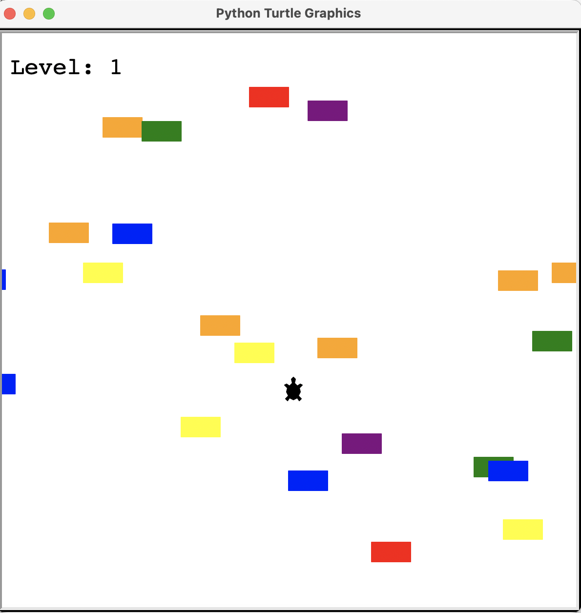
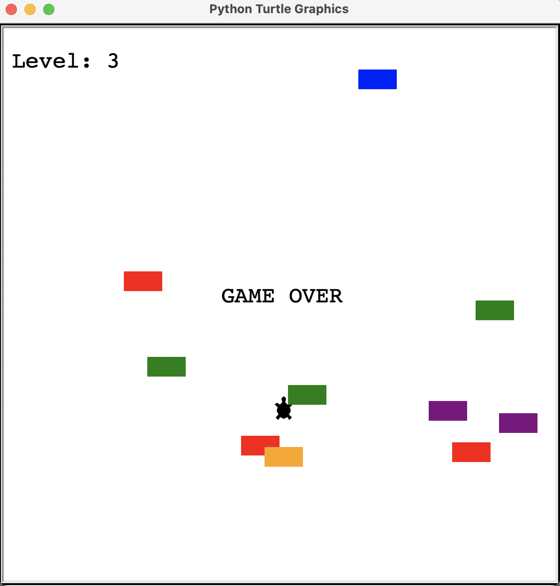

# turtle-crossing-game
Simple Python turtle crossing game using Python Turtle library

## Overview
This is what the gameplay looks like:



The player controls the turtle which can only go forwards, and there's a whole bunch of randomly generated cars which are going horizontally across the screen. Once the player reaches the top of the screen, the player moves on to the next level, starting back at the starting point but this time the cars speed up. At some point when the player turtle hits the car, then that is game over:



Commands to use:
- up-arrow-key = move up


## To download

```
git clone https://github.com/menonrudhra/turtle-crossing-game.git
cd turtle-crossing-game
```

## To run the App 

```
python3 main.py
```

